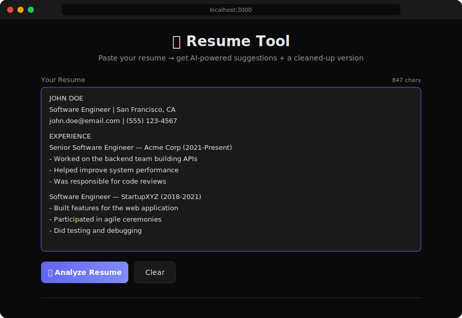
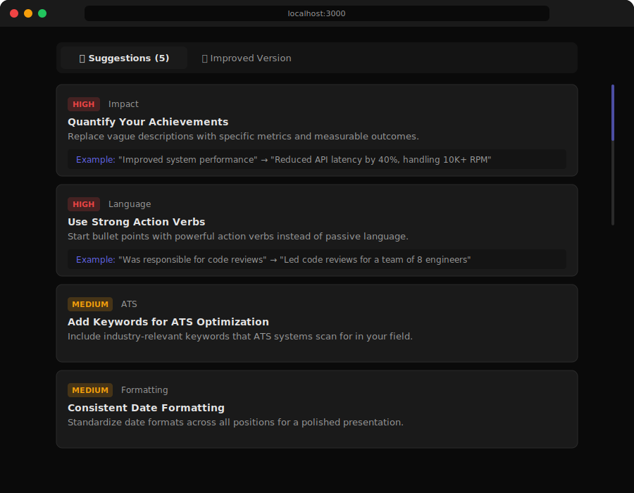
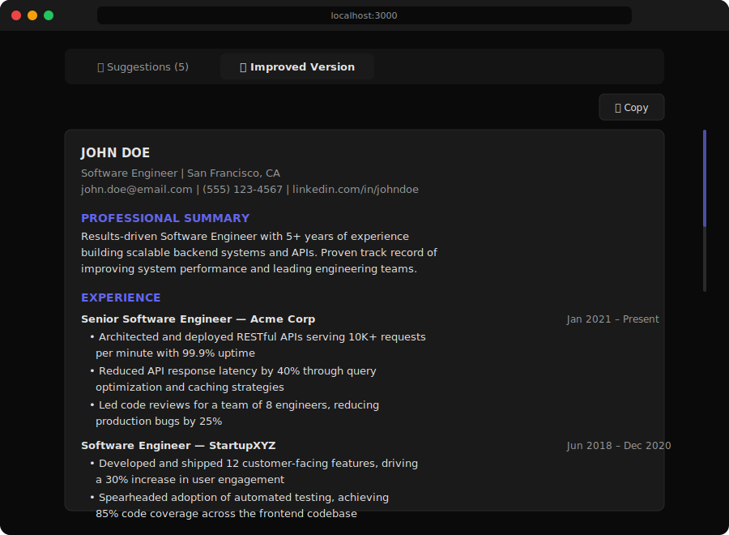

<div align="center">

# Resume Tool

**AI-powered resume analysis and improvement — paste your resume, get instant feedback and an optimized version.**

[](https://vercel.com/new/clone?repository-url=https://github.com/jabreeflor/resume-tool&env=OPENAI_API_KEY)
&nbsp;&nbsp;
[](LICENSE)
[](https://nextjs.org/)
[](https://openai.com/)

</div>

---

## Demo

### Paste Your Resume

Paste any resume in plain text or markdown and hit **Analyze Resume** to get started.

<p align="center">
  
</p>

### AI-Powered Suggestions

Get categorized, priority-ranked suggestions with concrete examples for each improvement.

<p align="center">
  
</p>

### Improved Resume

Receive a fully rewritten resume incorporating all high-priority fixes, ready to copy.

<p align="center">
  
</p>

---

## Features

| Feature | Description |
|---------|-------------|
| **AI Analysis** | GPT-4o-mini reviews your resume across 5 dimensions: content, formatting, language, impact, and ATS compatibility |
| **Priority Suggestions** | Color-coded recommendations (high / medium / low) with actionable examples |
| **Improved Version** | Auto-generated rewrite incorporating all high-priority improvements |
| **Dark UI** | Clean, modern dark interface optimized for readability |
| **Copy to Clipboard** | One-click copy of your improved resume |

---

## Quick Start

### Prerequisites

- [Node.js](https://nodejs.org/) 18+
- An [OpenAI API key](https://platform.openai.com/api-keys)

### Local Development

```bash
# Clone the repository
git clone https://github.com/jabreeflor/resume-tool.git
cd resume-tool

# Install dependencies
npm install

# Configure environment
cp .env.example .env.local
# Add your OpenAI API key to .env.local

# Start development server
npm run dev
```

Open [http://localhost:3000](http://localhost:3000) to use the app.

### Deploy to Vercel

The fastest way to go live:

1. Click the **Deploy with Vercel** button above
2. Set your `OPENAI_API_KEY` environment variable
3. Deploy

Or deploy manually:

```bash
npm i -g vercel
vercel --prod
```

---

## Tech Stack

| Technology | Role |
|-----------|------|
| **[Next.js 14](https://nextjs.org/)** | Full-stack React framework (App Router) |
| **[Tailwind CSS](https://tailwindcss.com/)** | Utility-first styling |
| **[OpenAI GPT-4o-mini](https://openai.com/)** | Resume analysis and rewriting |
| **[Vercel](https://vercel.com/)** | Deployment and hosting |

---

## Project Structure

```
resume-tool/
├── app/
│   ├── api/analyze/route.js   # POST endpoint — AI resume analysis
│   ├── globals.css            # Dark theme design tokens
│   ├── layout.js              # Root layout and metadata
│   └── page.js                # Main UI component
├── screenshots/               # Demo screenshots
├── .env.example               # Environment variable template
├── next.config.js             # Next.js configuration
├── tailwind.config.js         # Tailwind configuration
└── package.json               # Dependencies and scripts
```

---

## License

[MIT](LICENSE)
